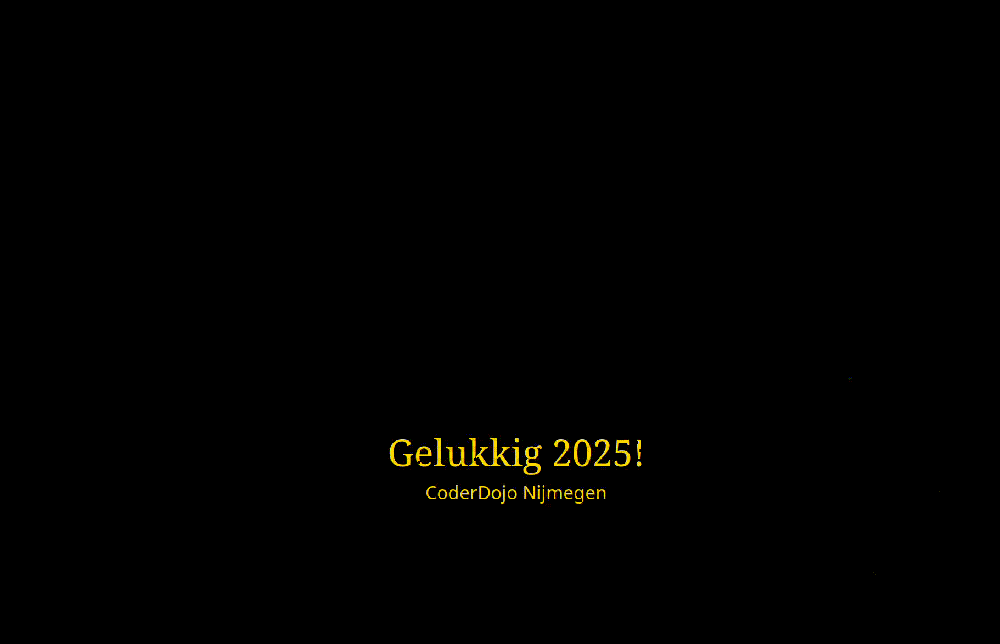
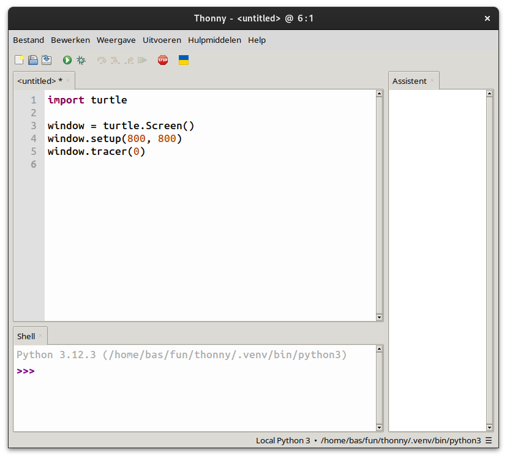
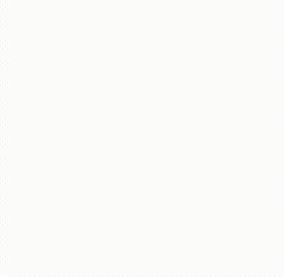
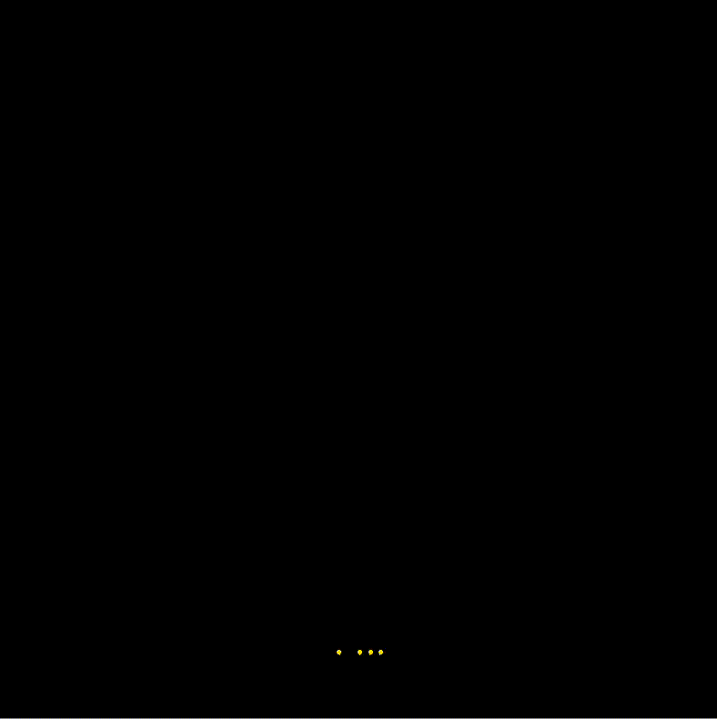
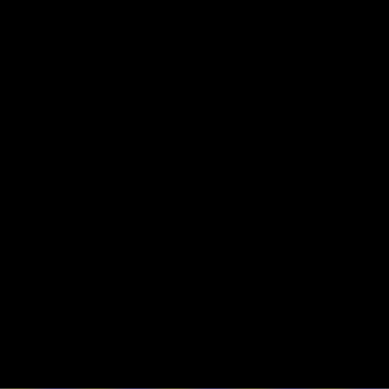
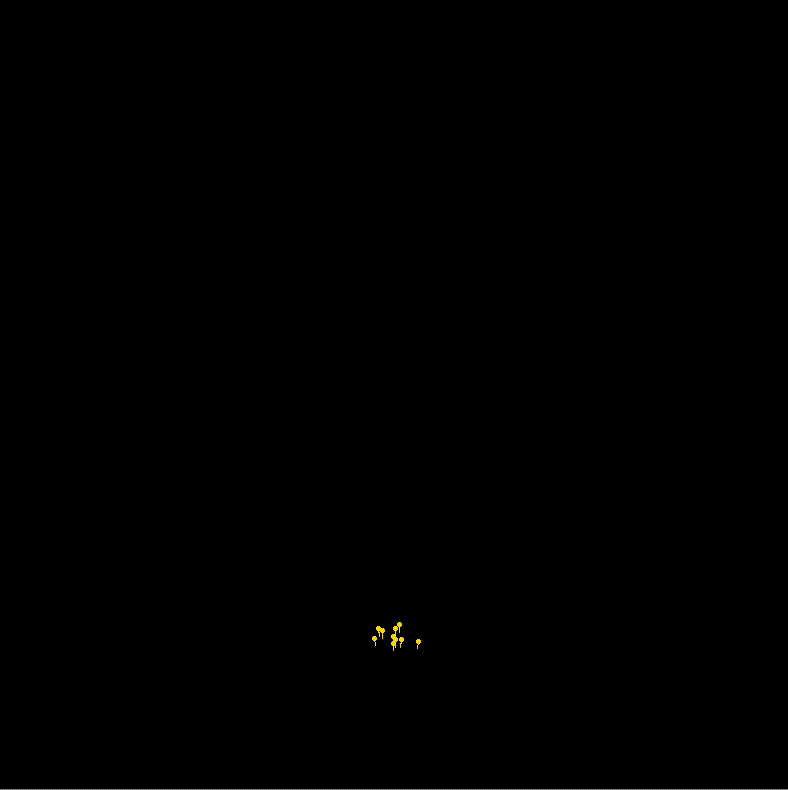
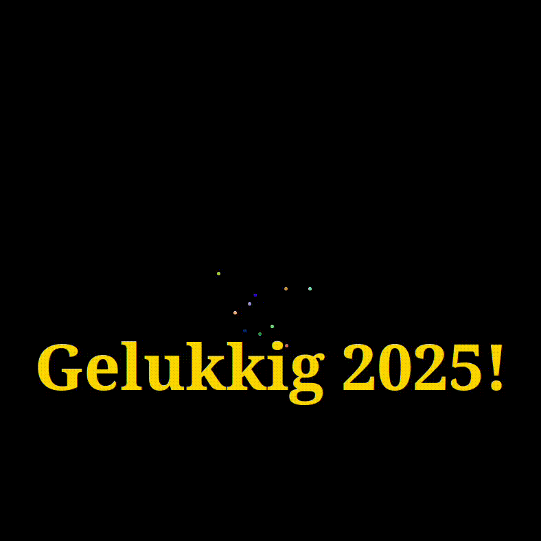

Dit is de eerste dojo in het nieuwe jaar 2025 en we maken deze keer vuurwerk!

<!--more-->



Bij oud en nieuw hoort vuurwerk, dus deze keer maken we met Python en de Turtle bibliotheek zelf ons vuurwerk.

Deze instructie is vrij uitgebreid en maakt gebruik van technieken die onbekend zijn voor beginners. Maar, als de
code goed wordt gekopieerd en plakt, moet het lukken iets werkends te krijgen zonder dat je precies begrijpt hoe het
werkt.  
En vergeet vooral geen hulp te vragen aan de mentoren. 😉

## Thonny installeren



## 🎆 Vuurwerk maken!

We beginnen met het maken van een vuurpijl die de lucht in schiet. Dat gaan we in stappen doen:

### 1. We maken een window
Neem het volgende over in Thonny:
```python
import turtle

window = turtle.Screen()
window.setup(800, 800)
window.tracer(0)
```

  

Druk op het groene knopje of F5 om het programma uit te proberen. 


**Let op!** als je het window niet met het kruisje rechts boven af kunt sluiten, gebruik dan de rode stopknop in Thonny. 


### 2. En een zwarte punt dat later de pijl wordt

```python
import turtle

window = turtle.Screen()
window.setup(800, 800)
window.tracer(0)

vuurpijl = turtle.Turtle()
vuurpijl.dot(5)
```
Voer het programma uit. Zie je de zwarte punt?

#### Opdrachten

1. pas een of beide getallen 800 in `window.setup(800, 800)` eens aan. Wat gebeurt er?
2. wat gebeurt er met de zwarte punt als je de 5 in `vuurpijl.dot(5)` verandert naar 10? Of naar 1?

### 3. De vuurpijl beweegt omhoog
Laten we eens kijken of we de punt naar boven kunnen laten bewegen.
```python
import turtle

window = turtle.Screen()
window.setup(800, 800)
window.tracer(0)

vuurpijl = turtle.Turtle()
vuurpijl.dot(5)
vuurpijl.setposition(0, 50)
vuurpijl.dot(5)
```
Als je dit uitvoert, zie je twee punten met een dunne lijn er tussen. Dat is niet helemaal wat we willen.
Eigenlijk willen we dat de punt beweegt.

#### Opdrachten

`setposition` betekent: zet de positie van de Turtle.
1. Zet de punten eens rechts in het window. Of juist links.
2. Hoe kun je de positie van de punten omhoog of omlaag veranderen?

### 4. De vuurpijl beweegt nu echt omhoog
```python
import turtle

window = turtle.Screen()
window.setup(800, 800)
window.tracer(0)

vuurpijl = turtle.Turtle()

for i in range(10):
    vuurpijl.clear()
    vuurpijl.setposition(0, 15 * i)
    vuurpijl.dot(5)
```
Staat de punt nog in het midden? Heb je het zien bewegen?

- Met `for i in range(10):` herhalen we de 3 ingesprongen regels eronder 10 keer
- `vuurpijl.clear()` verwijdert de laatst getekende punt, zodat je alleen de nieuwe, verschoven punt ziet
- `vuurpijl.setposition(0, 15 * i)` plaatst de punt, hierbij bepaald:
  - `0` de horizontale positie, waarbij 0 in het midden van het window is
  - `15 * i` de verticale positie, waarbij ook hier 0 in het midden van het window is; door 15 x i te gebruiken 
    verschuift de punt wat verder naar boven dan alleen met i; overigens verandert i van 0 tot en met 9 met de herhaling

#### Opdrachten

1. Wat gebeurt er als je de horizontale positie veranderd? Dus de 0 in `vuurpijl.setposition(0, 15 * i)` veranderd in 40 of -40?
2. En als je de 15 in `vuurpijl.setposition(0, 15 * i)` vergroot of verkleint of juist negatief maakt?

### 5. En nu dat je de vuurpijl echt ziet bewegen
```python
import turtle
from time import sleep

window = turtle.Screen()
window.setup(800, 800)
window.tracer(0)

vuurpijl = turtle.Turtle()
vuurpijl.hideturtle()

for i in range(100):
    vuurpijl.clear()
    vuurpijl.setposition(0, 3*i)
    vuurpijl.dot(5)
    window.update()
    sleep(0.1)
```
Je kunt de pijl nu echt zien bewegen, doordat

- er meer stappen worden gezet
- er tussen iedere stap even wordt gewacht door het `sleep(0.1)` commando

#### Opdrachten

1. Wat gebeurt er als je het aantal stappen verandert door 100 in `range(100)` te vervangen door 50 of juist 150?  
2. Of wanneer je het getal in `sleep(0.1)` verandert van 0.1 naar 0.02 of juist 0.2?  
3. Of wanneer je het getal 3 in `vuurpijl.setposition(0, 3*i)` verandert naar 2 of 5?

### 6. Een pijl beweegt meestal niet recht naar boven

We hebben in stap 4 gezien dat het aanpassen van de 0 in `vuurpijl.setposition(0, 3*i)` de horizontale positie van de
pijl veranderd. Maar een pijl beweegt meestal niet recht naar boven, maar eerder wat schuin:

```python
import turtle
from time import sleep

window = turtle.Screen()
window.setup(800, 800)
window.tracer(0)

vuurpijl = turtle.Turtle()
vuurpijl.hideturtle()

for i in range(100):
    vuurpijl.clear()
    vuurpijl.setposition(i, 5*i)
    vuurpijl.dot(5)
    window.update()
    sleep(0.1)
```
Je ziet nu dat de pijl naar rechts boven verplaatst. Dit komt doordat we 0 met i hebben vervangen in 
`vuurpijl.setposition(0, 5*i)`.

#### Opdrachten

1. Wat gebeurt er nu als je `-i` gebruikt?  
2. Of `-2 * i`?

### 7. Voorbereiden voor meerdere pijlen

Om zo makkelijker met meerdere pijlen te kunnen werken, moeten we de code even aanpassen:

```python
import turtle
from time import sleep

window = turtle.Screen()
window.setup(800, 800)
window.tracer(0)

class Vuurpijl:
    def __init__(self):
        self.turtle = turtle.Turtle()
        self.turtle.hideturtle()
        self.plaats_horizontaal = 0
        self.plaats_verticaal = 0
        self.snelheid_horizontaal = 1
        self.snelheid_verticaal = 3
        
    def beweeg(self):
        self.plaats_verticaal = self.plaats_verticaal + self.snelheid_verticaal
        self.plaats_horizontaal = self.plaats_horizontaal + self.snelheid_horizontaal
        self.turtle.clear()
        self.turtle.setposition(self.plaats_horizontaal, self.plaats_verticaal)
        self.turtle.dot(5)

vuurpijl = Vuurpijl()
for i in range(100):
    vuurpijl.beweeg()
    window.update()
    sleep(0.02)
```
Als je dit hebt uitgevoerd, zie je dat het nog steeds hetzelfde doet als bij stap 7. Dus wat is er nu eigenlijk 
veranderd en waarom?

- allereerst is de vuurpijl code in een "class" gestopt. Een class beschrijft de eigenschappen en gedrag van de vuurpijl.
  - in functie `__init__(self)` worden een aantal begin eigenschappen bepaald, zoals de horizontale en verticale plaats
    en snelheid
  - in functie `beweeg(self)` staat het gedrag van de vuurpijl. Bij iedere aanroep worden de horizontale en verticale
    plaats bepaald door er de horizontale en verticale snelheden bij op te tellen. Dan wordt de positie van de vuurpijl
    gezet met `self.turtle.setposition(self.plaats_horizontaal, self.plaats_verticaal)` en tenslotte getekend met
    `self.turtle.dot(5)`. 
- dan wordt er een "instantie" van de class Vuurpijl gemaakt: `vuurpijl = Vuurpijl()`. `vuurpijl` is nu een object van
  class `Vuurpijl` en heeft het gedrag van `Vuurpijl`. Door functie `vuurpijl.beweeg()` aan te roepen, gaat de vuurpijl
  bewegen.

#### Opdrachten

1. Speel eens met de waarden van `self.plaats_horizontaal`, `self.plaats_verticaal`, `self.snelheid_horizontaal`, 
`self.snelheid_verticaal`?  
2. Kun je de pijl ook van rechts boven in het window naar links onder laten bewegen? Wat moet daarvoor veranderen?

### 8. Fijn, die voorbereiding, nu wil ik meerdere pijlen!

```python
import turtle
from time import sleep

window = turtle.Screen()
window.setup(800, 800)
window.tracer(0)

class Vuurpijl:
    def __init__(self):
        self.turtle = turtle.Turtle()
        self.turtle.hideturtle()
        self.plaats_horizontaal = 0
        self.plaats_verticaal = 0
        self.snelheid_horizontaal = 1
        self.snelheid_verticaal = 3
        
    def beweeg(self):
        self.plaats_verticaal = self.plaats_verticaal + self.snelheid_verticaal
        self.plaats_horizontaal = self.plaats_horizontaal + self.snelheid_horizontaal
        self.turtle.clear()
        self.turtle.setposition(self.plaats_horizontaal, self.plaats_verticaal)
        self.turtle.dot(5)

vuurpijl1 = Vuurpijl()
vuurpijl2 = Vuurpijl()
for i in range(100):
    vuurpijl1.beweeg()
    vuurpijl2.beweeg()
    window.update()
    sleep(0.02)
```

Zie je `vuurpijl1` en `vuurpijl2`? Dat is alles wat er nodig is om 2 vuurpijlen te maken. Super handig!

Maar zie je ook 2 pijlen? Hoe zou het kunnen dat je er maar 1 ziet?

### 9. Nu echt meerdere pijlen!

Doordat bij stap 8 de 2 pijlen beiden op dezelfde plaats beginnen en precies dezelfde kant op gaan met dezelfde snelheid,
kun je niet zien dat het er echt 2 zijn.  
Om dit op te lossen kunnen de code aanpassen zodat we voor iedere pijl de horizontale en verticale snelheid kunnen
meegeven:

```python
import turtle
from time import sleep

window = turtle.Screen()
window.setup(800, 800)
window.tracer(0)

class Vuurpijl:
    def __init__(self, snelheid_horizontaal, snelheid_verticaal):
        self.turtle = turtle.Turtle()
        self.turtle.hideturtle()
        self.plaats_horizontaal = 0
        self.plaats_verticaal = 0
        self.snelheid_horizontaal = snelheid_horizontaal
        self.snelheid_verticaal = snelheid_verticaal
        
    def beweeg(self):
        self.plaats_verticaal = self.plaats_verticaal + self.snelheid_verticaal
        self.plaats_horizontaal = self.plaats_horizontaal + self.snelheid_horizontaal
        self.turtle.clear()
        self.turtle.setposition(self.plaats_horizontaal, self.plaats_verticaal)
        self.turtle.dot(5)

vuurpijl1 = Vuurpijl(-1, 3)
vuurpijl2 = Vuurpijl(0, 3)
vuurpijl3 = Vuurpijl(1, 3)
for i in range(100):
    vuurpijl1.beweeg()
    vuurpijl2.beweeg()
    vuurpijl3.beweeg()
    window.update()
    sleep(0.02)
```


Wat is er veranderd?

- functie `__init__` heeft argumenten `snelheid_horizontaal` en `snelheid_verticaal` gekregen, waardoor je iedere 
  vuurpijl een andere richting en snelheid kunt geven
- er zijn nu 3 vuurpijlen met verschillende snelheden. Je ziet dat pijl 1 een horizontale snelheid -1 heeft. Deze beweegt
  naar links. Pijl 2 heeft 0 en beweegt recht naar boven en pijl 3 met horizontale snelheid 1 beweegt naar rechts

#### Opdrachten

Speel eens met de waarden voor de vuurpijlen en kijk wat er gebeurd? 

Wat gebeurt er als je dit gebruikt? Vergeet je niet `vuurpijl4` ook te laten bewegen?

```python
vuurpijl1 = Vuurpijl(1, 3)
vuurpijl2 = Vuurpijl(-1, 3)
vuurpijl3 = Vuurpijl(1, -3)
vuurpijl4 = Vuurpijl(-1, -3)
```

### 10. Dit lijkt helemaal niet op vuurwerk!

Klopt! We hebben wat voorbereidend werk moeten doen en gaan nu eens kijken of we het meer op vuurwerk kunnen laten
lijken.

```python
import turtle
from time import sleep

window = turtle.Screen()
window.setup(800, 800)
window.tracer(0)
window.bgcolor("black")

class Vuurpijl:
    def __init__(self, snelheid_horizontaal, snelheid_verticaal):
        self.turtle = turtle.Turtle()
        self.turtle.hideturtle()
        self.turtle.color("gold")
        self.plaats_horizontaal = 0
        self.plaats_verticaal = -390
        self.snelheid_horizontaal = snelheid_horizontaal
        self.snelheid_verticaal = snelheid_verticaal
        
    def beweeg(self):
        self.plaats_verticaal = self.plaats_verticaal + self.snelheid_verticaal
        self.plaats_horizontaal = self.plaats_horizontaal + self.snelheid_horizontaal
        self.turtle.clear()
        self.turtle.setposition(self.plaats_horizontaal, self.plaats_verticaal)
        self.turtle.dot(5)

vuurpijl1 = Vuurpijl(1, 3)
vuurpijl2 = Vuurpijl(-1, 3)
vuurpijl3 = Vuurpijl(0, 3)
vuurpijl4 = Vuurpijl(0.5, 3)
for i in range(200):
    vuurpijl1.beweeg()
    vuurpijl2.beweeg()
    vuurpijl3.beweeg()
    vuurpijl4.beweeg()
    window.update()
    sleep(0.02)
```
Kijk:



Wat is er veranderd?

```python
window.bgcolor("black")

class Vuurpijl:
    def __init__(self, snelheid_horizontaal, snelheid_verticaal):
        self.turtle.color("gold")
        self.plaats_horizontaal = 0
        self.plaats_verticaal = -390

```

De achtergrondkleur is zwart gemaakt door `window.bgcolor("black")` toe te voegen.  
De pijlen zijn goudgeel geworden door `self.turtle.color("gold")` toe te voegen.

#### Opdrachten

1. Kijk eens op [deze pagina](https://wiki.tcl-lang.org/page/Color+Names%2C+running%2C+all+screens) en kies een andere 
   kleur voor de achtergrond of de pijlen.

### 11. Meer pijlen! Ik wil meer pijlen!

Met alle werk dat we hebben gedaan, kunnen we nu makkelijk nog meer pijlen toevoegen:

```python
import turtle
from time import sleep
from random import randint

window = turtle.Screen()
window.setup(800, 800)
window.tracer(0)
window.bgcolor("black")

class Vuurpijl:
    def __init__(self, snelheid_horizontaal, snelheid_verticaal):
        self.turtle = turtle.Turtle()
        self.turtle.hideturtle()
        self.turtle.color("gold")
        self.plaats_horizontaal = 0
        self.plaats_verticaal = -390
        self.snelheid_horizontaal = snelheid_horizontaal
        self.snelheid_verticaal = snelheid_verticaal
        
    def beweeg(self):
        self.plaats_verticaal = self.plaats_verticaal + self.snelheid_verticaal
        self.plaats_horizontaal = self.plaats_horizontaal + self.snelheid_horizontaal
        self.turtle.clear()
        self.turtle.setposition(self.plaats_horizontaal, self.plaats_verticaal)
        self.turtle.dot(5)

vuurpijlen = []
for _ in range(10):
    vuurpijlen.append(Vuurpijl(randint(-15, 15)/10, randint(20, 30)/10))

for i in range(200):
    for vuurpijl in vuurpijlen:
        vuurpijl.beweeg()
    window.update()
    sleep(0.02)
```



Hier zitten de belangrijke wijzigingen:

```python
vuurpijlen = []
for _ in range(10):
    vuurpijlen.append(Vuurpijl(randint(-15, 15)/10, randint(20, 30)/10))

for i in range(200):
    for vuurpijl in vuurpijlen:
        vuurpijl.beweeg()

```

- `vuurpijlen = []`: allereerst maken een we een lijst aan waarin we de vuurpijlen bewaren
- `for _ range(10):`: dan voegen we 10 pijlen aan het lijstje toe
- functie `randint(-15, 15)` geeft zomaar een getal tussen -15 en 15 terug, dus bij een eerste aanroep bijvoorbeeld 3, 
  maar bij een volgende -4 en dan weer 9. Hierdoor kunnen we ervoor zorgen dat de pijlen met verschillende horizontale
  en verticale snelheden gaan bewegen.  
  We delen het resultaat door 10, omdat `randint` alleen maar gehele getallen teruggeeft, dus geen komma getallen zoals
  1.5. -15 tot +15 zou een veel te grote horizontale snelheid opleveren en de pijlen links en rechts uit het window laten 
  vliegen. `randint(-15, 15)/10` levert getallen op tussen -1.5 en +1.5 wat beter werkt.
- tenslotte halen we met `for vuurpijl in vuurpijlen:` één voor één de vuurpijlen uit het lijstje en roepen de 
  `vuurpijl.beweeg()` functie aan om de pijlen een stap te laten maken.

#### Opdrachten

1. Kijk eens of je nog meer pijlen kunt maken. Wat gebeurt er als je er heel veel hebt?
2. Kun je de pijlen links/rechts uit het beeld laten vliegen?

### 12. Maar vuurpijlen vallen toch weer naar beneden?

Dat klopt. De zwaartekracht zorgt ervoor dat de vuurpijlen afremmen, tot stilstand komen en dan weer naar beneden vallen:



```python
import turtle
from time import sleep
from random import randint

window = turtle.Screen()
window.setup(800, 800)
window.tracer(0)
window.bgcolor("black")

class Vuurpijl:
    def __init__(self, snelheid_horizontaal, snelheid_verticaal):
        self.turtle = turtle.Turtle()
        self.turtle.hideturtle()
        self.turtle.color("gold")
        self.plaats_horizontaal = 0
        self.plaats_verticaal = -390
        self.snelheid_horizontaal = snelheid_horizontaal
        self.snelheid_verticaal = snelheid_verticaal
        self.zwaartekracht = 0.06
        
    def beweeg(self):
        self.plaats_verticaal = self.plaats_verticaal + self.snelheid_verticaal
        self.plaats_horizontaal = self.plaats_horizontaal + self.snelheid_horizontaal
        self.snelheid_verticaal = self.snelheid_verticaal - self.zwaartekracht
        self.turtle.clear()
        self.turtle.setposition(self.plaats_horizontaal, self.plaats_verticaal)
        self.turtle.dot(5)

vuurpijlen = []
for _ in range(10):
    vuurpijlen.append(Vuurpijl(randint(-15, 15)/10, 6 + randint(20, 30)/10))

for i in range(300):
    for vuurpijl in vuurpijlen:
        vuurpijl.beweeg()
    window.update()
    sleep(0.02)

```

Met de belangrijkste wijzigingen:

```python
class Vuurpijl:
    def __init__(self, snelheid_horizontaal, snelheid_verticaal):
        self.zwaartekracht = 0.06
        
    def beweeg(self):
        self.snelheid_verticaal = self.snelheid_verticaal - self.zwaartekracht
```

Hier zie je een variabele met de zwaartekracht met waarde 0.06. Deze wordt bij iedere keer dat het vuurwerk getekend
wordt, van de verticale snelheid afgetrokken. Daardoor gaat de vuurpijl steeds langzamer omhoog en uiteindelijk weer
naar beneden.

#### Opdrachten

1. Wat gebeurt er als je de zwaartekracht vergroot? Bijvoorbeeld naar waarde 0.1?
2. Of verkleind naar bijvoorbeeld waarde 0.04?

### 13. Doe maar verschillende pijlen

De pijlen gaan al verschillende richtingen op en hebben verschillende snelheden, maar verschillende kleuren zou ook 
leuk zijn!

```python
import turtle
from time import sleep
from random import randint

window = turtle.Screen()
window.setup(800, 800)
window.colormode(255)
window.tracer(0)
window.bgcolor("black")

class Vuurpijl:
    def __init__(self, kleur, snelheid_horizontaal, snelheid_verticaal):
        self.turtle = turtle.Turtle()
        self.turtle.hideturtle()
        self.turtle.color(*kleur)
        self.plaats_horizontaal = 0
        self.plaats_verticaal = -390
        self.snelheid_horizontaal = snelheid_horizontaal
        self.snelheid_verticaal = snelheid_verticaal
        self.zwaartekracht = 0.06
        
    def beweeg(self):
        self.plaats_verticaal = self.plaats_verticaal + self.snelheid_verticaal
        self.plaats_horizontaal = self.plaats_horizontaal + self.snelheid_horizontaal
        self.snelheid_verticaal = self.snelheid_verticaal - self.zwaartekracht
        self.turtle.clear()
        self.turtle.setposition(self.plaats_horizontaal, self.plaats_verticaal)
        self.turtle.dot(5)
    
def zomaar_een_kleur():
    return randint(0, 255), randint(0, 255), randint(0, 255)

vuurpijlen = []
for _ in range(10):
    vuurpijlen.append(Vuurpijl(zomaar_een_kleur(), randint(-15, 15)/10, 6 + randint(20, 30)/10))

for i in range(400):
    for vuurpijl in vuurpijlen:
        vuurpijl.beweeg()
    window.update()
    sleep(0.02)
```


<strong>R G B</strong>  

Beeldschermen kunnen eigenlijk maar 3 kleuren maken: rood, groen en blauw. Door deze samen te mengen kun je alle andere kleuren maken:
<style>
  td { border: 1px solid grey; } 
</style>
<table style="width: 100%; text-align: center; border-collapse: collapse">
  <thead>
    <tr><th style="background-color: #FF0000">R</th><th style="background-color: #00FF00">G</th><th style="background-color: #0000FF; color: #FFFFFF">B</th><th>de mengkleur</th></tr>
  </thead>
  <body>
    <tr><td>0</td><td>0</td><td>0</td><td style="background-color: #000"></td></tr>
    <tr><td>255</td><td>0</td><td>0</td><td style="background-color: #FF0000"></td></tr>
    <tr><td>255</td><td>255</td><td>0</td><td style="background-color: #FFFF00"></td></tr>
    <tr><td>0</td><td>255</td><td>0</td><td style="background-color: #00FF00"></td></tr>
    <tr><td>0</td><td>255</td><td>255</td><td style="background-color: #00FFFF"></td></tr>
    <tr><td>0</td><td>0</td><td>255</td><td style="background-color: #0000FF"></td></tr>
    <tr><td>255</td><td>0</td><td>255</td><td style="background-color: #FF00FF"></td></tr>
    <tr><td>255</td><td>128</td><td>255</td><td style="background-color: #FF7FFF"></td></tr>
    <tr><td>128</td><td>128</td><td>128</td><td style="background-color: #7F7F7F"></td></tr>
    <tr><td>255</td><td>255</td><td>255</td><td style="background-color: #FFFFFF"></td></tr>
  </body>
</table>
  
In bovenstaande tabel zie je links de hoeveelheden van iedere kleur en rechts welke kleur het mengsel oplevert. Voor
iedere kleur kun je een waarde van 0 tot en met 255 gebruiken.  
Als je geen van de kleuren gebruikt, krijg je zwart!  
Gebruik je ze allemaal maximaal, dan krijg je wit!  
**Samen kun je daarmee ruim 16 miljoen verschillende kleuren maken!**


Wat is er veranderd in de code?

```python
class Vuurpijl:
    def __init__(self, kleur, snelheid_horizontaal, snelheid_verticaal):
        self.turtle.color(*kleur)

    
def zomaar_een_kleur():
    return randint(0, 255), randint(0, 255), randint(0, 255)

for _ in range(10):
    vuurpijlen.append(Vuurpijl(zomaar_een_kleur(), randint(-15, 15)/10, 6 + randint(20, 30)/10))

```

- Met parameter `kleur` in `def __init__(self, kleur, snelheid_horizontaal, snelheid_verticaal):` kunnen een kleur meegeven
  aan de vuurpijl
- We willen voor iedere vuurpijl een andere kleur, dus maakt `def zomaar_een_kleur():` iedere keer een ander mengsel als
  je het aanroept. Zoals eerder verteld, maakt `randint(0, 255)` zomaar een getal en in dit geval tussen 0 en 255.
- Als we tenslotte de pijl maken met `vuurpijlen.append(Vuurpijl(zomaar_een_kleur(), randint(-15, 15)/10, 6 + randint(20, 30)/10))`
  geven we daar het resultaat van functie `zomaar_een_kleur()` mee. Hierdoor heeft iedere vuurpijl een andere kleur.

#### Opdracht

1. Je kunt hier niet veel mee experimenteren, maar voor het programma eens meerdere keren uit en kijken of de kleuren iedere
  keer anders zijn?

### 14. Deze pijlen ploffen niet uit elkaar... ☹️

Of toch wel, maar dan moet je nog wel heel wat aanpassen aan de code...

Kopieer en plak deze code maar in Thonny en je zult het zien!

```python
import turtle
from time import sleep
from random import randint
from math import sin, cos, pi

aantal_vuurpijlen = 10
stukken = 11
start_positie = (0, -390)

class Vuurpijl:
    def __init__(self, kleur, plaats, snelheid):
        self.turtle = turtle.Turtle()
        self.turtle.hideturtle()
        self.turtle.color(*kleur)
        self.color = kleur
        self.plaats_horizontaal = plaats[0]
        self.plaats_verticaal = plaats[1]
        self.snelheid_horizontaal = snelheid[0]
        self.snelheid_verticaal = snelheid[1]
        self.vanaf_de_grond = plaats == start_positie
        self.zwaartekracht = 0.06

    def beweeg(self):
        self.plaats_verticaal = self.plaats_verticaal + self.snelheid_verticaal
        self.plaats_horizontaal = self.plaats_horizontaal + self.snelheid_horizontaal
        self.snelheid_verticaal = self.snelheid_verticaal - self.zwaartekracht
        self.turtle.clear()
        self.turtle.penup()
        self.turtle.setposition(self.plaats_horizontaal, self.plaats_verticaal)
        self.turtle.pendown()
        self.turtle.dot(5)

    def is_boven(self):
        return self.snelheid_verticaal < 0

    def positie(self):
        return self.plaats_horizontaal, self.plaats_verticaal

    def snelheid(self):
        return self.snelheid_horizontaal, self.snelheid_verticaal

    def clear(self):
        self.turtle.clear()

    def is_vanaf_de_grond(self):
        return self.vanaf_de_grond
    
    def kleur(self):
        return self.color

def zomaar_een_kleur():
    return randint(1, 255), randint(1, 255), randint(1, 255)


def zomaar_een_richting_en_snelheid(snelheid, i):
    hoek = i * 180 / stukken
    return (snelheid[0] + 1 * sin(pi * hoek),
            snelheid[1] + 1 * cos(pi * hoek))


def main():
    window = turtle.Screen()
    window.setup(800, 800)
    window.colormode(255)
    window.tracer(0)
    window.bgcolor("black")

    vuurpijlen = []
    while True:
        for vuurpijl in vuurpijlen:
            vuurpijl.beweeg()
            if vuurpijl.is_vanaf_de_grond() and vuurpijl.is_boven():
                vuurpijl.clear()
                for j in range(stukken):
                    vuurpijlen.append(Vuurpijl(vuurpijl.kleur(), vuurpijl.positie(),
                                               zomaar_een_richting_en_snelheid(vuurpijl.snelheid(), j)))
                vuurpijlen.remove(vuurpijl)
            if vuurpijl.positie()[1] < -400:
                vuurpijlen.remove(vuurpijl)
        if len(vuurpijlen) < aantal_vuurpijlen:
            vuurpijlen.append(Vuurpijl(zomaar_een_kleur(), start_positie, (randint(-15, 15) / 10, 6 + randint(20, 30) / 10)))
        window.update()
        sleep(0.02)

if __name__ == "__main__":
    main()
```

Iets te veel wijzigingen om uit te leggen, maar...

### 15. Waar blijft de nieuwjaarswens?

Gaan we meteen aan werken:

```python
import turtle
from time import sleep
from random import randint
from math import sin, cos, pi

aantal_vuurpijlen = 10
stukken = 11
start_positie = (0, -390)

class Vuurpijl:
    def __init__(self, kleur, plaats, snelheid):
        self.turtle = turtle.Turtle()
        self.turtle.hideturtle()
        self.turtle.color(*kleur)
        self.color = kleur
        self.plaats_horizontaal = plaats[0]
        self.plaats_verticaal = plaats[1]
        self.snelheid_horizontaal = snelheid[0]
        self.snelheid_verticaal = snelheid[1]
        self.vanaf_de_grond = plaats == start_positie
        self.zwaartekracht = 0.06

    def beweeg(self):
        self.plaats_verticaal = self.plaats_verticaal + self.snelheid_verticaal
        self.plaats_horizontaal = self.plaats_horizontaal + self.snelheid_horizontaal
        self.snelheid_verticaal = self.snelheid_verticaal - self.zwaartekracht
        self.turtle.clear()
        self.turtle.penup()
        self.turtle.setposition(self.plaats_horizontaal, self.plaats_verticaal)
        self.turtle.pendown()
        self.turtle.dot(5)

    def is_boven(self):
        return self.snelheid_verticaal < 0

    def positie(self):
        return self.plaats_horizontaal, self.plaats_verticaal

    def snelheid(self):
        return self.snelheid_horizontaal, self.snelheid_verticaal

    def clear(self):
        self.turtle.clear()

    def is_vanaf_de_grond(self):
        return self.vanaf_de_grond
    
    def kleur(self):
        return self.color

def zomaar_een_kleur():
    return randint(1, 255), randint(1, 255), randint(1, 255)


def zomaar_een_richting_en_snelheid(snelheid, i):
    hoek = i * 180 / stukken
    return (snelheid[0] + 1 * sin(pi * hoek),
            snelheid[1] + 1 * cos(pi * hoek))


def main():
    window = turtle.Screen()
    window.setup(800, 800)
    window.colormode(255)
    window.tracer(0)
    window.bgcolor("black")

    text = turtle.Turtle()
    text.hideturtle()
    text.color("gold")
    text.penup()
    text.setposition((0, -200))
    text.pendown()
    text.write("Gelukkig 2025!", font=("serif", 70, "normal"), align="center")

    vuurpijlen = []
    while True:
        for vuurpijl in vuurpijlen:
            vuurpijl.beweeg()
            if vuurpijl.is_vanaf_de_grond() and vuurpijl.is_boven():
                vuurpijl.clear()
                for j in range(stukken):
                    vuurpijlen.append(Vuurpijl(vuurpijl.kleur(), vuurpijl.positie(),
                                               zomaar_een_richting_en_snelheid(vuurpijl.snelheid(), j)))
                vuurpijlen.remove(vuurpijl)
            if vuurpijl.positie()[1] < -400:
                vuurpijlen.remove(vuurpijl)
        if len(vuurpijlen) < aantal_vuurpijlen:
            vuurpijlen.append(Vuurpijl(zomaar_een_kleur(), start_positie, (randint(-15, 15) / 10, 6 + randint(20, 30) / 10)))
        window.update()
        sleep(0.02)

if __name__ == "__main__":
    main()
```

Wat is er veranderd?

```python
    text = turtle.Turtle()
    text.hideturtle()
    text.color("gold")
    text.penup()
    text.setposition((0, -200))
    text.pendown()
    text.write("Gelukkig 2025!", font=("serif", 70, "bold"), align="center")
```

#### Opdrachten

Met alles wat je in de voorgaande stappen hebt geleerd, kun je het volgende proberen?

1. Verander de kleur van de tekst in rood of een andere kleur.
2. Kun je de tekst boven in het window plaatsen?
3. Verander de tekst naar je eigen nieuwjaarswens. Als de tekst te groot kun je het kleiner maken door getal 70 op 
  regel 7 te verlagen.

### Het eindresultaat

We hebben vandaag veel gedaan en hopelijk heb je veel geleerd!

CoderDojo wenst je een...




